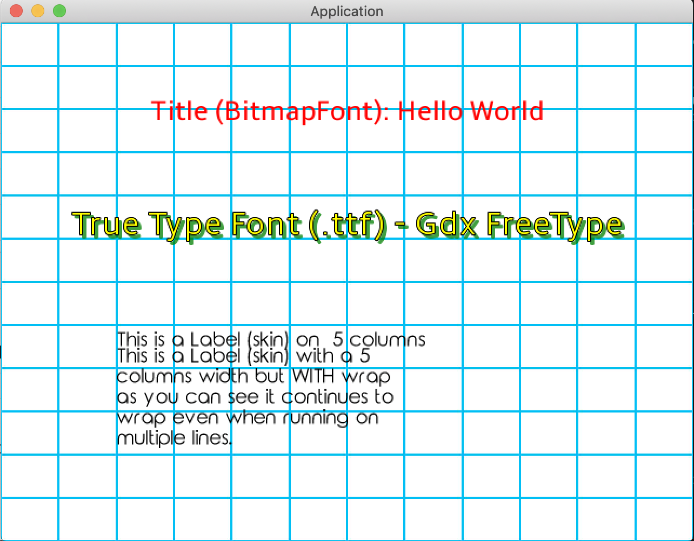

## Fonts and Labels 

LibGDX, game engine written in Java. KTX, Kotlin DSL for LibDGX. 

Second tutorial in the LibGDX series, adapted for Kotlin.
https://libgdx.info/basic-label/

### About

If you are attempting to learn more about Kotlin and LibGDX this is a great second step, see previous solutions here: https://github.com/bajabob/libgdx-ktx-image-manipulation. This tutorial aims to teach you about LibGDX Fonts and Labels. 

### Uses 
 TODO

### Screenshot

### How to Run

Clone or download a zip of the project

From the root of the project, execute: `./gradlew :desktop:run`